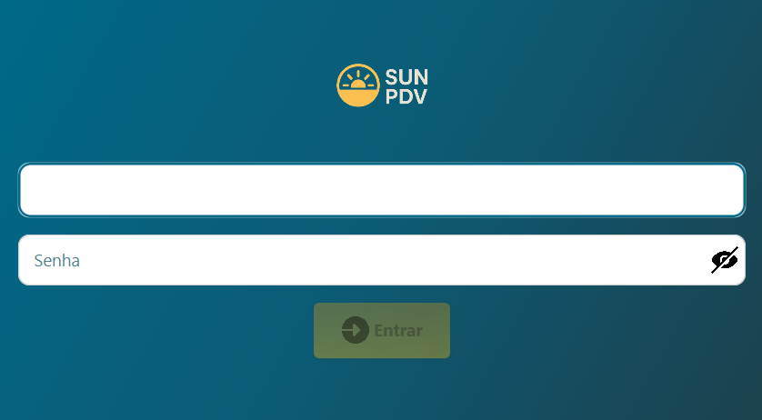

<p align="center">
  <strong>Sistema de Ponto de Venda (PDV)</strong><br>
  Uma aplicação Java completa com JavaFX, JDBC e SQL Server, feita para controle de produtos, usuários e autenticação segura.
</p>

<p align="center">
  
  
  
</p>

---

## 📸 Demonstração



---

## ✨ Recursos

- 🔐 **Login Seguro** com SHA-256 e AES
- 🧍‍♂️ **Gestão de Usuários** com diferentes níveis de acesso
- 📦 **Controle de Produtos**: entrada e saída com código de barras
- 📊 **Interface Moderna** com JavaFX + CSS externo
- 🗄️ **Banco de Dados local** (SQL Sever)
- ⏳ **Bloqueio Temporário** após tentativas inválidas
- 🔄 **Feedback Visual** com animações de transição

---

## 🛠️ Tecnologias

| Tecnologia | Descrição |
|------------|-----------|
| `Java 21` | Linguagem base do projeto |
| `JavaFX` | Framework gráfico para UI moderna |
| `SQL Server` | Banco de dados relacional |
| `JDBC` | Conexão entre Java e banco de dados |
| `CSS` | Estilização da interface via arquivo externo |

---

## 🧩 Estrutura do Projeto

```bash
sun-pdv/
│
├── 📂 .vscode/
│
├── 📂 src/main/
│   ├── 📂 java/com/sunpdv/
│   │   ├── 📂 connection/
│   │   │    └── 📜 ConexaoDB.java
│   │   ├── 📂 model/
│   │   │    ├── 📜 AutenticarUser.java
│   │   │    ├── 📜 log.java
│   │   │    ├── 📜 module-info.java
│   │   │    ├── 📜 Produto.java
│   │   │    └── 📜 TaxaPagamentoServive.java
│   │   ├── 📂 telas/
│   │   │    ├── 📂 home/
│   │   │    │    ├── 📜 TelaHomeADM.java
│   │   │    │    ├── 📜 TelaHomeFUN.java
│   │   │    │    └── 📜 TelaHomeMOD.java
│   │   │    └── 📂 operacao/
│   │   │    │    ├── 📜 Caixa.java
│   │   │    │    ├── 📜 Configurar.java
│   │   │    │    ├── 📜 LoginApp.java
│   │   │    │    ├── 📜 Produtos.java
│   │   │    │    └── 📜 Usuarios.java
│   │   └── 📜 App.java 
│   └── 📂 resources/
│       ├── 📂 css/
│       │    └── 📜 style.css
│       └── 📂 img/
│
├── 📂 target/
│
├── 📜 .gitignore
├── 📜 SUN-PDV.app.jar
├── 📜 README.md
├── 📜 Package-lock.json
└── 📜 pom.xml
